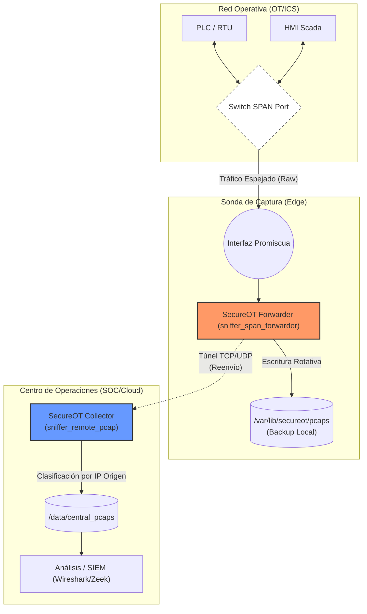

# Agente educativo de monitoreo de tráfico

El código presentado es a modo educativo para entender en forma simple como funciona una aplicación de monitoreo pasivo del tráfico de red.

## Comparativa de aplicaciones presente en el mercado para monitoreo de redes industriales

| Herramienta | Tipo / Enfoque | ¿PCAP offline? | Protocolos ICS | Topología / Inventario | Detección de amenazas | Gestión de vulnerabilidades | Integraciones | Curva de uso | Nivel de Madurez | Mejores casos |
|-------------|----------------|----------------|----------------|------------------------|-----------------------|-----------------------------|---------------|--------------|------------------|---------------|
| **Wireshark / Tshark** | Analizador de paquetes (manual/CLI) | ✅ | Alto (Modbus, S7Comm, DNP3, BACnet, IEC-104, etc.) | Parcial (endpoints/conversations) | ❌ | ❌ | Export CSV/PCAP | Baja | **Básico** | Triage inicial, análisis puntual de tramas |
| **GrassMarlin** | Descubrimiento pasivo ICS | ✅ | ICS comunes | ✅ (mapa Purdue, segmentos) | ❌ | ❌ | Export inventario | Media | **Básico** | Mapeo topología OT desde PCAP |
| **Zeek** | Framework análisis de tráfico | ✅ | Via packages ICS | Parcial (inventario en conn.log) | ❌ (nativo) | ❌ | SIEM, CSV, JSON | Media-Alta | **Intermedio** | Normalización masiva de PCAP, hunting |
| **Suricata** | IDS/IPS basado en firmas | ✅ | Depende ruleset (ET ICS) | ❌ | ✅ (rules) | ❌ | SIEM (EVE JSON) | Media | **Intermedio** | Detección IOC y anomalías de protocolos OT |
| **Arkime (Moloch)** | Indexación masiva de PCAP | ✅ | Neutro | ❌ | ❌ | ❌ (integra con Zeek) | UI web, SIEM | Media | **Intermedio** | Revisión histórica, búsqueda masiva de sesiones |
| **Malcolm** | Suite lista (Zeek + Arkime + Dashboards) | ✅ | Via Zeek | Parcial (dashboards) | Parcial (con Suricata) | ❌ | OpenSearch, Arkime UI | Media | **Intermedio** | Plataforma open-source todo en uno para equipos |
| **Claroty CTD** | NDR OT comercial | ✅ | Muy amplio ICS | ✅ Completo | ✅ Avanzada + ML | ✅ (con CVM) | SIEM, SOAR, ticketing | Media | **Enterprise** | Visibilidad y detección integral OT |
| **Nozomi Guardian** | NDR OT/IoT | ✅ | Muy amplio ICS | ✅ Completo | ✅ Análisis avanzado | Parcial (con partners) | SIEM, SOAR, firewalls | Media | **Enterprise** | Grandes despliegues OT críticos |
| **Tenable.ot** | OT Security + vulnerabilidades | ✅ | Amplio ICS | ✅ Inventario detallado | ✅ | ✅ fuerte | Tenable.io, SIEM | Media | **Enterprise** | Foco en compliance + VM OT |
| **Defender for IoT (MS)** | OT/IoT integrado Azure | ✅ | ICS + IoT | ✅ | ✅ (IoC + ML) | ✅ (integraciones) | Sentinel, XDR | Baja-Media | **Enterprise** | Organizaciones en ecosistema Microsoft |
| **Dragos Platform** | Threat Intel + detección OT | ✅ | Amplio ICS | ✅ | ✅ Avanzada + TI Dragos | Parcial | SIEM, SOAR | Media-Alta | **Enterprise** | Infraestructura crítica, energía |
| **Forescout (SilentDefense)** | OT/IoT/TI convergente | ✅ | ICS + IoT | ✅ Híbrido | ✅ | ✅ | NAC, SIEM, SOAR | Media | **Enterprise** | Organizaciones OT/IoT/TI mixtas |
| **SCADAfence Platform** | Visibilidad y detección OT | ✅ | ICS estándar | ✅ | ✅ Anomalías | Parcial | SIEM, SOAR | Media | **Enterprise** | Manufactura discreta/continua |
| **Armis Centrix (OT module)** | Seguridad OT/IoT unificada | ✅ | ICS + IoT | ✅ Unificado | ✅ | ✅ Riesgos + exposiciones | SIEM, SOAR | Baja-Media | **Enterprise** | Convergencia OT/IoT/IT empresarial |


### Código de agentes secureot y su rol

| Característica | `sniffer_remote_pcap` | `sniffer_span_forwarder` | `sniffer_span_pcap` |
| :--- | :--- | :--- | :--- |
| **Origen del Tráfico** | Remoto (desde la red) | Local (desde la interfaz) | Local (desde la interfaz) |
| **Rol** | Receptor / Servidor | Agente de Captura y Reenvío | Agente de Captura |
| **Capacidad de Reenvío** | No aplica (es el receptor) | ✅ Sí | ❌ No |
| **Lógica de Enrutamiento** | Por IP de origen del paquete **remoto** | Por IP de origen/destino **del paquete capturado** | Por IP de origen/destino **del paquete capturado** |
| **Filtros de Captura** | No tiene | ✅ Sí (filtro BPF) | ✅ Sí (filtro BPF) |

### 🔍 Sniffer pasivo por puerto SPAN
El agente puede operar en modo pasivo escuchando tráfico duplicado desde un puerto SPAN (Switch Port Analyzer). Esta modalidad le permite capturar paquetes en tiempo real sin interferir en la red, ideal para monitoreo continuo, auditorías y detección de anomalías en entornos OT donde la intervención directa no es posible.

#### 📘 Ejemplos de configuración SPAN por modelo

| Marca / Modelo         | Método de Configuración SPAN                                                                                          | Observaciones / Limitaciones                                                                 |
|------------------------|-------------------------------------------------------------------------------------------------------------------------|----------------------------------------------------------------------------------------------|
| **Cisco 2960X**        | CLI: `monitor session 1 source interface Gi1/0/1`, `monitor session 1 destination Gi1/0/24`                            | Permite múltiples sesiones SPAN, pero sin soporte ERSPAN nativo                              |
| **Cisco SG300 / SF300**| GUI: *Administration > Diagnostics > Port and VLAN Mirroring*                                                          | Solo admite una sesión SPAN a la vez                                                         |
| **Aruba 2030M**        | CLI: `mirror-port 24`, `monitor interface 1 both` (modelos como Aruba 2930M)                                           | Usar sintaxis adecuada según la versión de ArubaOS                                           |
| **HP 1920G**           | GUI: *Network > Port Mirroring*                                                                                        | Interfaz web simple, sin acceso completo a CLI en muchos modelos                             |
| **H3C 5500 EI**        | CLI: `mirroring-group 1`, `mirroring-group 1 mirroring-port GigabitEthernet1/0/1 both`, `mirroring-group 1 monitor-port GigabitEthernet1/0/24` | Soporta grupos de monitoreo, configuración más detallada                                     |
| **3Com 5500 / 5500G**  | CLI: `monitor session 1 source interface ...`, `monitor session 1 destination interface ...`                           | Similar a H3C; firmware compartido puede tener diferencias sutiles en comandos               |
| **FortiSwitch 124F**   | CLI: `config switch mirror`, `edit "m1"`, `set dst port5`, `set src-ingress port3`, `set src-egress port4`, `set status active`, `end` | No admite mirroring entre VLANs sin configuración avanzada                                   |
| **FortiGate 60F / 30D**| CLI: `config system virtual-switch`, `edit lan`, `set span enable`, `set span-source-port`, `set span-dest-port`, `end`| Solo funciona en interfaces tipo hardware/software switch; no aplicable a interfaces físicas |

### Sniffer pasivo por puerto SPAN y Reenvío

Este agente permite capturar tráfico en crudo desde una interfaz de red (por ejemplo, un puerto SPAN) y reenviarlo en tiempo real a un colector central remoto mediante socket TCP o UDP, según configuración. Además, segmenta y almacena localmente el tráfico en archivos PCAP rotativos por hora y por dirección IP origen, lo cual permite disponer de un respaldo forense y operativo robusto en todo momento. La configuración es completamente dinámica vía YAML, soportando filtros BPF, reglas de enrutamiento por IP y parámetros de reenvío. Este componente está diseñado para desplegarse en entornos OT como puente de captura fuera de banda o colector distribuido.


### 📡 Sniffer remoto con recepción por puerto TCP/UDP
El agente también puede actuar como receptor activo de tráfico, escuchando conexiones entrantes a través de un puerto configurable. Esta modalidad permite recibir datos desde nodos remotos o arquitecturas de reenvío, integrándose como colector central en despliegues distribuido. Además, implementa un sistema de rotación horaria de archivos PCAP y definición por IP de origen, permitiendo segmentar el tráfico recibido en archivos independientes para cada fuente. Compatible con LINKTYPE_RAW, puede registrar payloads sin encabezados Ethernet, facilitando integraciones en entornos OT que requieren flexibilidad y separación lógica del tráfico.

## Diagrama de operación



## Instalación como servicio

Se recomienda estandarizar las rutas para logs y configuraciones.

```bash
sudo mkdir -p /etc/secureot /var/lib/secureot-agent/pcaps
sudo chmod 755 /var/lib/secureot-agent/
```

Copia el binario compilado y el archivo de configuración:

```
sudo cp target/release/sniffer_span_forwarder /usr/local/bin/
sudo cp sniffer_span_forwarder/config.yaml /etc/secureot/forwarder.yaml
```

Creación del Servicio (Systemd)

/etc/systemd/system/secureot-forwarder.service:

```toml
[Unit]
Description=SecureOT Span Forwarder Agent
After=network.target network-online.target
Wants=network-online.target

[Service]
Type=simple
# Ejecutar como root es necesario para abrir la interfaz en modo promiscuo
User=root
ExecStart=/usr/local/bin/sniffer_span_forwarder /etc/secureot/forwarder.yaml
Restart=always
RestartSec=5s
# Límites para evitar que el buffer de escritura bloquee el sistema
LimitNOFILE=65535

[Install]
WantedBy=multi-user.target
```

Optimización de Interfaz (NIC) y del sistema

Aumentar el Buffer del Kernel:

```bash
# Aumentar buffer de recepción a 100MB (ajustar según RAM)
sudo sysctl -w net.core.rmem_max=104857600
sudo sysctl -w net.core.rmem_default=104857600
```

Aumentar el Ring Buffer de la NIC:

Ver maximo soportado
```
ethtool -g eth0
```
Configurar al máximo (ej. 4096)
```
sudo ethtool -G eth0 rx 4096
```

Para evitar la pérdida de paquetes en tráfico de alta velocidad (Gigabit+), se debe desactivar el offloading en la interfaz de captura:

Añadir esto a un script de inicio o netplan
```
sudo ethtool -K eth0 gro off gso off tso off lro off
```

Activación

```
sudo systemctl daemon-reload
sudo systemctl enable --now secureot-forwarder
sudo systemctl status secureot-forwarder
```

# Debug en tiempo real del SecureOT Agent

Este documento describe cómo depurar y observar el funcionamiento del agente en tiempo real
utilizando herramientas de traza de sistema, kernel y red.

---

## Syscalls y librerías con strace / ltrace / dtrace

- strace: ver llamadas al sistema relacionadas con red y archivos.

    # Adjuntar a un PID existente
    sudo strace -ff -tt -s 200 -e trace=network,file -p <PID> -o strace_agent.log

    # Lanzar el binario y tracearlo desde el inicio
    sudo strace -ff -tt -s 200 -e trace=network,file ./secureot-agent --config config.yaml 2>strace.log

### ltrace (Linux)

`ltrace` permite observar las llamadas a librerías dinámicas (ej. glibc, libpcap).

    # Ver todas las llamadas de biblioteca del proceso
    sudo ltrace -p $(pgrep secureot-agent)

    # Guardar en log
    sudo ltrace -p $(pgrep secureot-agent) -o ltrace.log

    # Mostrar solo funciones de libpcap
    sudo ltrace -p $(pgrep secureot-agent) -e pcap_* -o ltrace_pcap.log

    # Ver cada vez que abre archivos o escribe
    sudo ltrace -p $(pgrep secureot-agent) -e fopen,fwrite,fclose

### dtrace (BSD, Solaris, macOS, Linux con soporte)

`dtrace` permite instrumentar syscalls y funciones de libc en tiempo real.

    # Ver cada vez que el proceso llama sendto()
    sudo dtrace -n 'syscall::sendto:entry /execname == "secureot-agent"/ { printf("%d bytes -> fd %d\n", arg2, arg0); }'

    # Ver llamadas a open() hechas por el agente
    sudo dtrace -n 'syscall::open*:entry /execname == "secureot-agent"/ { printf("open %s\n", copyinstr(arg0)); }'

    # Medir latencia de sendto()
    sudo dtrace -n 'syscall::sendto:entry /execname=="secureot-agent"/ { self->ts = timestamp; }
                    syscall::sendto:return /self->ts/ { printf("sendto latency %dus\n", (timestamp - self->ts)/1000); self->ts=0; }'


---

## Trazado a nivel kernel con eBPF (bpftrace / bcc)

Ejemplo con bpftrace para ver llamadas sendto del proceso:

    # Mostrar tamaño y fd de cada sendto de secureot-agent
    sudo bpftrace -e 'tracepoint:syscalls:sys_enter_sendto /comm == "secureot-agent"/ { printf("pid=%d fd=%d size=%d\n", pid, args->fd, args->size); }'

Scripts útiles de bcc-tools: tcpconnect, tcplife, trace.

---

## Ver sockets y procesos

    # Listar sockets abiertos
    sudo ss -pan | grep <PID>

    # Ver descriptores de archivo de red
    sudo lsof -p <PID> -nP | grep SOCK

---

## Depuración con gdb / rr

    # Usar gdb para depurar paso a paso
    gdb ./secureot-agent

    # Grabar y reproducir con rr
    rr record ./secureot-agent --config config.yaml
    rr replay

---

## Comandos de ejemplo combinados

    # 1) Collector de prueba
    nc -klu 9999 &

    # 2) Lanzar agente
    ./secureot-agent --config example.yaml &

    # 3) Captura con tcpdump
    sudo tcpdump -i any -w /tmp/flow.pcap host <collector_ip> &

    # 4) Syscalls de red con strace
    sudo strace -ff -tt -s 200 -e trace=network -p $(pgrep secureot-agent) -o /tmp/strace_net.log &

    # 5) eBPF para sendto
    sudo bpftrace -e 'kprobe:sys_sendto /pid == PID/ { printf("sendto pid=%d fd=%d size=%d\n", pid, ((int)PT_REGS_PARM1(ctx)), ((int)PT_REGS_PARM3(ctx))); }'

